# 📘 Bola Paneli «Parvoz» — To'liq Texnik Topshiriq (TZ)

> Ushbu hujjat **Farzandim** ekotizimidagi **bola ilovasi (Parvoz)**ning har bir ekranini ipidan-ignasigacha tavsiflaydi: maqsad, qayerdan ochilishi, UI tuzilishi (yuqoridan-pastga har bir blok), ma'lumot manbai (provider + backend), holatlar (loading/bo'sh/xato), foydalanuvchi amallari va muhim eslatmalar.
>
> Manba: ilova kodi (`farzandim_child/lib`) to'liq o'qib chiqildi. Hech qaysi ekran qoldirilmadi.

---

## 0. Umumiy ma'lumot

| Parametr | Qiymat |
|---|---|
| **Ilova** | Parvoz — bola tomonidagi mobil ilova (`farzandim_child`) |
| **Texnologiya** | Flutter (Dart 3), Riverpod (state), go_router (navigatsiya), easy_localization (uz/ru/en) |
| **Backend** | NestJS + Fastify + Prisma + PostgreSQL (consumer JWT: audience `farzandim-consumer`) |
| **Real-time** | Socket.io (voice/video/notification/schedule WS event) + FCM push |
| **Dizayn** | «Parvoz NIGHT/GLASS» (Stitch redizayn) — deep navy fon `#0B1C30`, aqua aksent `#22D3EE`, glass kartalar, Plus Jakarta Sans / Inter |
| **Tema** | Light asosiy (Duolingo-uslub) + Dark fallback; `themeModeProvider` (light/dark/system) |
| **Ekranlar soni** | ~33 ta route + native overlay (bloklash) + widget-darajadagi SOS |

### Dizayn palitrasi (asosiy tokenlar)
- **Fon:** dark `#0B1C30` / light `#F8F9FF`
- **Karta:** dark `#213145` / `#162B45` / light `#E5EEFF` / oq
- **Aqua brend:** dark `#22D3EE` / light `#0E7490`
- **Matn:** dark `#F8F9FF` / light `#0B1C30`; muted: `#CBDBF5` / `#5A6B66`
- **Holat ranglari:** success `#13C28B`, danger `#FB3B4E`, warning `#FF9F1C`, gold `#FFC83D`
- Eski tokenlar (`AppColors.parvoz*`): `parvozBg`, `parvozGreen`, `parvozSurface`, `parvozText`, `parvozTextDim`, `parvozBorder` — ba'zi ekranlar hali shularda.

---

## 1. Navigatsiya va Routing mantiqi

**Boshlang'ich route:** `/splash`. SplashScreen pairing + consent + permissions holatini tekshirib to'g'ri ekranga yo'naltiradi.

**Router refresh:** `refreshListenable` — `pairingStateProvider` yoki `consentStateProvider` o'zgarganda redirect qayta hisoblanadi (router QAYTA yaratilmaydi — aks holda PairingScreen unmount bo'lardi).

**Redirect qoidalari (tartib bilan):**
1. **Consent guard:** `consent == notGiven` va ekran `/consent`/`/splash` emas → `/consent`. Rozilik berilgach `/consent`da bo'lsa → `/splash`.
2. **Public paths** (pairing oqimi, himoyasiz): `/splash`, `/pairing`, `/pair-waiting`, `/qr-scan`, `/consent`, `/onboarding`.
3. Eski `/welcome` → `/pairing`.
4. **Pair yo'q** + himoyalangan ekran → `/pairing`.
5. **Pair bor** + hali `/pairing`da → `/splash` (permission tekshiruvi uchun).
6. **Content library flag** (`kEnableContentLibrary == false`): `/analytics`, `/videos`, `/audiobooks`, `/contests`, `/ranking` va h.k. → `/dashboard` (deep-link himoyasi).

**Sahifa o'tish animatsiyasi:** Dashboard'dan boshqa ekranga `_slidePage` — 250ms, `easeOutCubic`, o'ngdan-chapga slide + fade (drill-down hissi).

### Barcha route'lar xaritasi

| Route | Ekran | Guruh |
|---|---|---|
| `/splash` | SplashScreen | Auth |
| `/consent` | ConsentScreen | Auth |
| `/welcome` | WelcomeScreen (eski → `/pairing`) | Auth |
| `/onboarding` | OnboardingScreen (qiziqishlar) | Auth |
| `/pairing` | PairingScreen (5 raqamli kod) | Auth |
| `/pair-waiting` | PairWaitingScreen | Auth |
| `/qr-scan` | QrScannerScreen | Auth |
| `/permissions` | PermissionsScreen (runtime) | Auth |
| `/permission-setup` | PermissionSetupScreen (4 sistema) | Auth |
| `/dashboard` | ChildDashboardScreen | Asosiy |
| `/account-edit` | AccountEditScreen | Akkaunt |
| `/settings` | SettingsScreen | Akkaunt |
| `/profile` | ProfileScreen (XP/yutuq) | Akkaunt |
| `/notifications` | NotificationsScreen | Akkaunt |
| `/content` | ContentHubScreen | Media |
| `/videos` | VideosFeedScreen | Media |
| `/video-player` | YouTube / Reels / Classic player | Media |
| `/audiobooks` | AudiobooksFeedScreen | Media |
| `/audio-player` | AudioPlayerScreen | Media |
| `/books` | BooksFeedScreen | Media |
| `/books/pdf` | PdfViewerScreen | Media |
| `/articles` | ArticlesFeedScreen | Maqola |
| `/articles/view` | ArticleViewScreen | Maqola |
| `/contests` | ContestsScreen | Konkurs |
| `/contest-start` | ContestStartScreen | Konkurs |
| `/contest-quiz` | ContestQuizScreen | Konkurs |
| `/certificate` | CertificateScreen | Konkurs |
| `/ranking` | RankingScreen | Reyting |
| `/video-recording` | VideoRecordingScreen | Aloqa |
| `/video-preview` | VideoPreviewScreen | Aloqa |
| `/voice-chat` | VoiceChatScreen | Aloqa |
| `/schedules` | SchedulesScreen | Jadval |
| `/analytics` | AnalyticsScreen | Statistika |
| *native overlay* | Ilova bloklash + UnlockRequestModal | Cheklov |
| *widget* | SosButton (alohida route yo'q) | SOS |

---

## 2. ONBOARDING / AUTH ekranlar

### Splash Screen (`/splash`)

- **Fayl:** `splash/presentation/screens/splash_screen.dart`
- **Maqsad:** Ilova har ochilganda birinchi ishga tushadigan boshlang'ich ekran. Routing qarori qabul qiluvchi markaziy nuqta — foydalanuvchini to'g'ri ekranga yo'naltiradi.
- **Qachon/qayerdan ochiladi:** Router `initialLocation`. Shuningdek Onboarding/Pairing/PairWaiting/QrScanner ekranlaridan `context.go('/splash')` bilan — markaziy routing mantiqini bir joyda ushlab turish uchun.
- **UI tuzilishi:** `Scaffold` (`parvozBg`) → `Center > Column`: 112×112 dumaloq logo (`ClipOval > Image.asset('child_logo_icon.png')`) → 24px → "Parvoz" (`parvozText`, 28px bold) → 24px → `CircularProgressIndicator(parvozGreen)`. Animatsiya yo'q.
- **Ma'lumot manbai:** `ConsentStorage.isParentConsentGiven()` (SharedPreferences `parent_consent_v1`), `parentUid`/`childId`/`onboarding_seen_v1` prefs, `UsageStatsService` (`hasPermission`, `hasOverlayPermission`), `Permission.locationAlways/ignoreBatteryOptimizations`.
- **Routing mantiq (qat'iy tartib):** 1) consent yo'q → `/consent`; 2) `parentUid==null || childId==null` → `/pairing`; 3) `onboarding_seen_v1 != true` → `/onboarding`; 4) `kIsWeb` → `/dashboard`; 5) 4 sistema ruxsati to'liq → `/dashboard`, aks holda → `/permission-setup`.
- **Holatlar:** Yagona vizual (logo + matn + spinner). Qaror ~50–250ms (parallel storage o'qish + 250ms brend-flash).
- **Eslatma:** Notification/Camera bu yerda tekshirilmaydi (runtime ad-hoc). Web'da permission tekshiruvsiz to'g'ridan-to'g'ri `/dashboard`.

### Consent Screen (`/consent`)

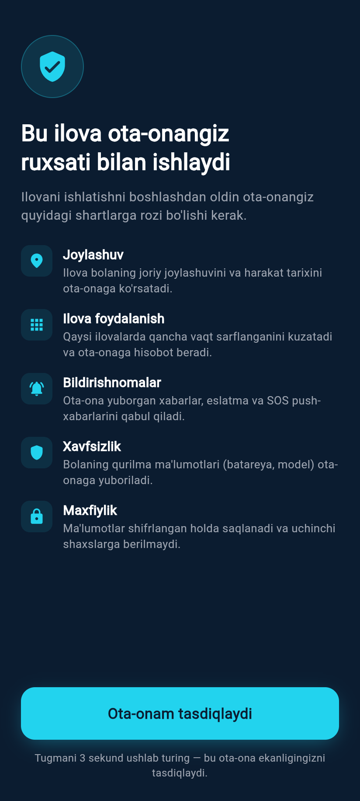

- **Fayl:** `consent/presentation/screens/consent_screen.dart`
- **Maqsad:** Store compliance — ota-ona roziligi. BIRINCHI ochishda ko'rsatiladi, rozilik berilmaguncha ilova ishlamaydi.
- **Qachon/qayerdan ochiladi:** `SplashScreen` → `isParentConsentGiven()==false`. Router himoyasi — ruxsatsiz o'tib bo'lmaydi.
- **UI tuzilishi:** `Scaffold(parvozBg)` → scrollable: `_ShieldBadge` (72×72 yashil doira + `verified_user_rounded`) → sarlavha "Bu ilova ota-onangiz ruxsati bilan ishlaydi" (26px, w800) → tavsif → **5 ta `_ConsentBullet`** (Joylashuv / Ilova foydalanish / Bildirishnomalar / Xavfsizlik / Maxfiylik, har biri 36×36 ikon + sarlavha + tavsif) → **`_LongPressConfirmButton`** (60px, `parvozGreen`, ichida `parvozBlue` progress fill chap→o'ng) → ko'rsatma "Tugmani 3 sekund ushlab turing".
- **Ma'lumot manbai:** `consentStateProvider.confirm()` → `ConsentStorage` → prefs `parent_consent_v1=true`. `AnimationController(3s)`.
- **Holatlar:** Bosish boshlanganda progress to'ladi + `HapticFeedback.lightImpact`; 3s'dan oldin qo'yib yuborilsa `reverse()`; 3s to'lganda `mediumImpact` + "Tasdiqlanmoqda..." + spinner; tugagach router avtomatik o'tadi.
- **Eslatma:** 3s long-press — bola tasodifan bosib o'tmasligi uchun.

### Welcome Screen (`/welcome`)

- **Fayl:** `welcome/presentation/screens/welcome_screen.dart`
- **Maqsad:** Brend kutib olish ekrani (eski oqim). Hozir splash uni bypass qiladi — kod bazasida saqlangan.
- **UI tuzilishi:** `Scaffold(parvozBg)` → logo (`child_app_icon_white.png`, `fadeIn + slideY`) → `FaroMascot(body, 220)` (`fadeIn + scale easeOutBack`) → tagline → CTA tugma (`parvozGreen`, "Boshlash" + `arrow_forward`, → `/pairing`) → codeHint.
- **Eslatma:** Hozirgi oqimda foydalanuvchi ko'rmaydi (splash to'g'ridan `/pairing`).

### Onboarding Screen (`/onboarding`)

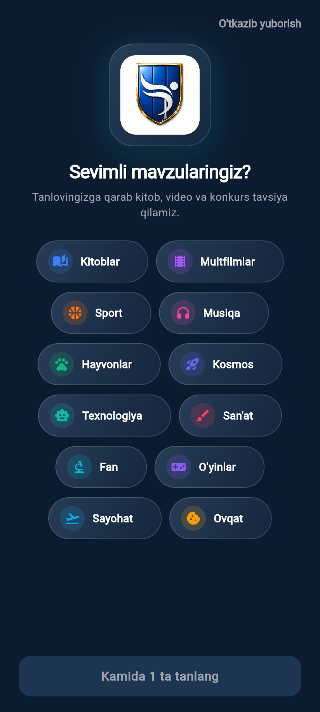

- **Fayl:** `onboarding/presentation/screens/onboarding_screen.dart`
- **Maqsad:** Pairing'dan keyin BIR MARTA — bola qiziqishlarini tanlaydi (personalizatsiya uchun backendga yuboriladi).
- **Qachon/qayerdan ochiladi:** `SplashScreen` → pairing bor, `onboarding_seen_v1 != true`.
- **UI tuzilishi:** Yuqorida "O'tkazib yuborish" → `_LogoHero` (132×132 glass + yashil glow) → sarlavha + tavsif → `_SelectedCounter` (yashil pill, 0 da ko'rinmaydi) → **chip grid** (`Wrap`, `kInterestOptions` — har biri 32×32 ikon + matn + tanlanganda yashil check, layout shift yo'q, ketma-ket `fadeIn+moveY`) → pastki tugma ("Boshlash (N ta)" / disabled "minSelect").
- **Ma'lumot manbai:** `kInterestOptions` (statik), `interestsSyncServiceProvider` → `PUT /children/me/interests`, prefs `onboarding_seen_v1` + `child_interests_pending_v1`.
- **Amallar:** chip → `selectionClick` toggle; "O'tkazib yuborish" → faqat `seen=true`; "Boshlash" → prefs pending + backend sync → `/splash`.
- **Eslatma:** Backend xato bo'lsa pending prefs'da qoladi, keyin qayta yuboriladi.

### Pairing Screen (`/pairing`)

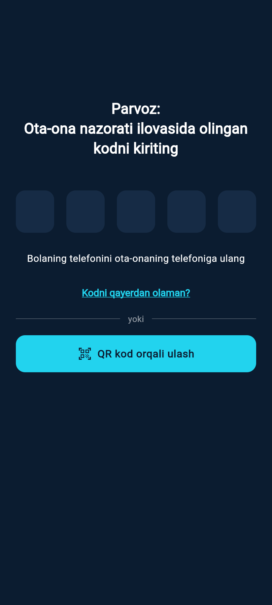

- **Fayl:** `pairing/presentation/screens/pairing_screen.dart`
- **Maqsad:** 5 raqamli oila ulash kodi (ota-ona ilovasida generatsiya bo'ladi).
- **Qachon/qayerdan ochiladi:** Splash (`parentUid/childId == null`); Welcome "Boshlash".
- **UI tuzilishi:** `Scaffold(parvozBg)` → sarlavha (appName + subtitle) → **5 ta kod katakchasi** (58×64, to'lganda 2px `parvozGreen` border, `digitsOnly`, `maxLength:1`) → hint → "Yordam" havola (`AlertDialog`) → "YOKI" ajratuvchi → **"QR kod orqali ulash"** tugma (`parvozGreen`, → `context.push('/qr-scan')`) → `_isPairing` bo'lsa spinner.
- **Ma'lumot manbai:** `pairingStateProvider.tryPair(code)` → `POST /api/auth/child-pair`. `PairingStatus`: pairing/paired/error/awaitingParent.
- **Holatlar:** raqam to'lganda avto-fokus keyingi; bo'sh katakchada Backspace → oldingi; 5-raqamda avto-pairing; muvaffaqiyat → `/splash`; 409 AWAITING_PARENT → `/pair-waiting`; xato → `SnackBar` + katakchalar tozalanadi.
- **Eslatma:** `_isPairing` guard ikki marta yuborishni to'xtatadi.

### Pair Waiting Screen (`/pair-waiting`)

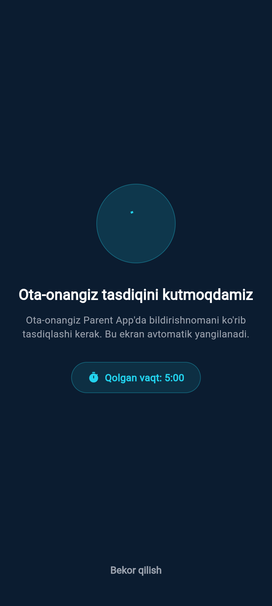

- **Fayl:** `pairing/presentation/screens/pair_waiting_screen.dart`
- **Maqsad:** Ota-ona tasdiqini kutish (backend `AWAITING_PARENT_CONFIRM`). Tasdiqlansa avto-dashboard.
- **UI tuzilishi:** 120×120 ikon doirasi (kutish → spinner; rejected → qizil block; expired → qizil soat) → sarlavha + tavsif → **countdown pill** (qolgan vaqt M:SS, faqat kutishda) → pastki tugma ("Bekor qilish" / xatoda "Qaytadan urinish").
- **Ma'lumot manbai:** `pairingStateProvider` (`pairRequestId`, `pairRequestExpiresAt`); `checkPairStatus(id)` → `GET /child-pair-status/:id` (Pending/Approved/Rejected/Expired/Error sealed).
- **Holatlar:** PENDING (polling 3s) / APPROVED (`completeFromApprovedPair` → `/splash`) / REJECTED / EXPIRED / ERROR (jim log).
- **Eslatma:** `Timer.periodic(3s)` polling + `Timer.periodic(1s)` countdown, `dispose`'da to'xtaydi; `_polling` flag.

### QR Scanner Screen (`/qr-scan`)

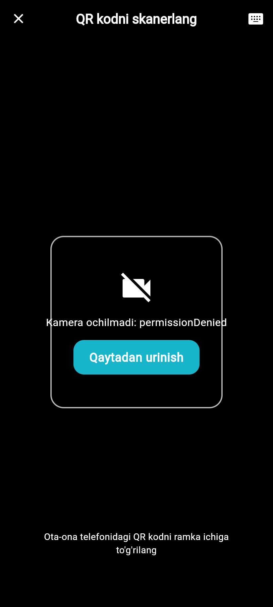

- **Fayl:** `pairing/presentation/screens/qr_scanner_screen.dart`
- **Maqsad:** `farzandim:repair:{token}` QR'ni skanerlab tez qayta ulanish (repair) → `POST /api/auth/repair-redeem`.
- **UI tuzilishi:** 3 rejim — (A) **Muvaffaqiyat** `_PairSuccessView` (gradient + `ConfettiWidget` + 132/92px check `elasticOut` + "Muvaffaqiyatli ulandingiz!" + 2200ms → `/splash`); (B) **Qo'lda paste** `_WebPasteTokenView` (clipboard + `TextField` + "Ulanish"); (C) **Kamera** (`MobileScanner` + 260×260 viewfinder + status panel; `starting/granted/denied/error` holatlar).
- **Ma'lumot manbai:** `POST /auth/repair-redeem` (`{token, platform}`) → `accessToken/refreshToken/user.id/child.id/child.parentId`; `tokenStorageProvider`; `completeFromApprovedPair`.
- **Eslatma:** Web'da kamera ruxsati "denied" qaytaradi → to'g'ridan-to'g'ri start; back→front fallback; `_humanizeCameraError()` O'zbekcha xatolar.

### Permissions Screen (`/permissions`)

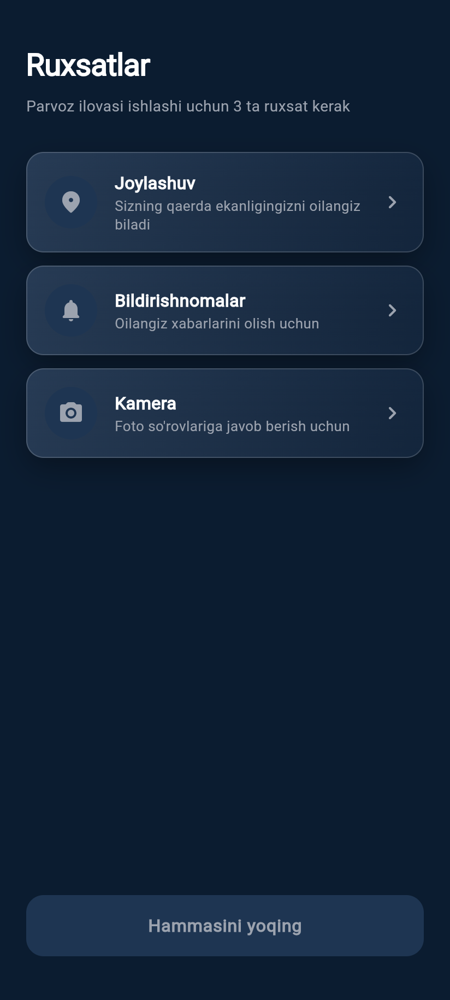

- **Fayl:** `permissions/presentation/screens/permissions_screen.dart`
- **Maqsad:** 3 runtime ruxsatni (joylashuv, bildirishnoma, kamera) ketma-ket auto-so'rash.
- **UI tuzilishi:** sarlavha + tavsif → auto-progress banner (spinner + "N/total") → **3 ta plitka** (`parvozGlass`, 48×48 ikon, yoqilsa yashil check) → "Davom etish" (hammasi yoqilsa faol).
- **Ma'lumot manbai:** `permission_handler` (`locationWhenInUse`→`locationAlways`, `notification`, `camera`); `locationServiceProvider.start()` + `backgroundServiceProvider.start()`.
- **Holatlar:** initState 800ms → auto-prompt (har biri orasida 400ms); hammasi yoqilsa avto-`_onContinue` → `/permission-setup`.
- **Eslatma:** Android 11+ da `locationAlways` Sozlamalarga olib chiqadi; har `request()` try/catch.

### Permission Setup Screen (`/permission-setup`) — yangilangan: 4 ta

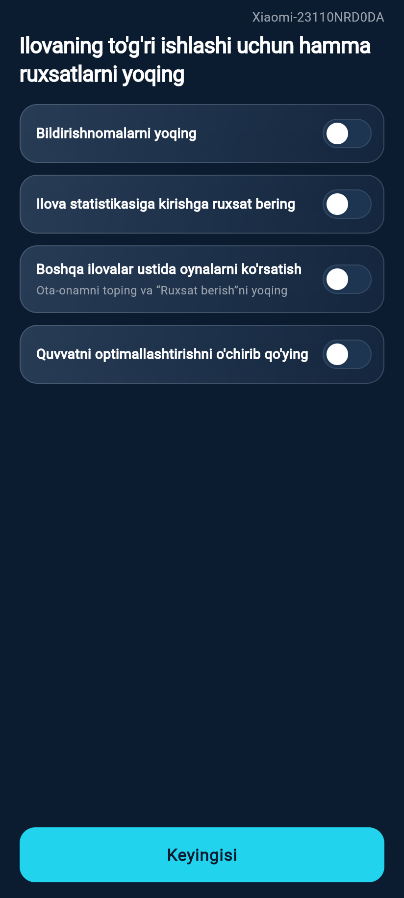

- **Fayl:** `permissions/presentation/screens/permission_setup_screen.dart`
- **Maqsad:** 4 ta ENG ZARUR sistema ruxsati: **Bildirishnoma** (FCM), **Ilova nazorati** (`PACKAGE_USAGE_STATS`), **Ilova ustida ko'rsatish** (`SYSTEM_ALERT_WINDOW` — bloklash ekrani), **Quvvat optimizatsiyasi** (xizmat tirik qolishi). (Avval 10 ta edi — qisqartirildi.)
- **UI tuzilishi:** Header (qurilma nomi placeholder + sarlavha) → `ListView` 4 ta `_PermissionCard` (glass + custom iOS-style toggle 50×30, `AnimatedAlign` 180ms) → "Keyingisi" (hammasi yoqilsa `parvozGreen`).
- **Ma'lumot manbai:** `UsageStatsService` (`hasPermission`/`hasOverlayPermission`/`openSettings`/`openOverlaySettings`), `Permission.notification`/`ignoreBatteryOptimizations`. `WidgetsBindingObserver` → resumed'da `_checkAll()` avto.
- **Holatlar:** Sozlamalardan qaytganda toggle avto-yangilanadi; web'da mock toggle + tugma doim faol.
- **Eslatma:** `PACKAGE_USAGE_STATS` + `SYSTEM_ALERT_WINDOW` standart `permission_handler`'da yo'q → `UsageStatsService` (native kanal). `_toggle()` try/catch.

---

## 3. DASHBOARD / AKKAUNT ekranlar

### Bosh sahifa — Dashboard (`/dashboard`)

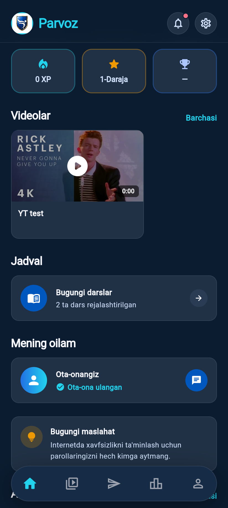

- **Fayl:** `dashboard/presentation/screens/child_dashboard_screen.dart`
- **Maqsad:** Asosiy kirish nuqtasi — XP/daraja/reyting, bugungi videolar, jadval, oila, maslahat, audiokitob, ilova foydalanish va SOS bitta skroll sahifada.
- **Qachon/qayerdan ochiladi:** Ishga tushganda; bottom nav "Bosh sahifa"; `/permission-setup`'dan keyin; notifications "SOS" tugmasidan.
- **UI tuzilishi (yuqoridan-pastga):**
  1. **Glass Header** (`_GlassHeader`, sticky, `BackdropFilter blur 20`): chap — 40×40 logo + "Parvoz" (aqua, 24px w700); o'ng — bildirishnoma (`_IconBtn`, o'qilmagan bo'lsa qizil nuqta badge) + sozlamalar tugmalari.
  2. **UpdateBanner** — yangi versiya chiqsa.
  3. **Stats Section** — 3 ta `_StatCard`: XP (`local_fire`, `${n}k XP`), Daraja (`star`, `${level}-Daraja`, `levelForXp`), Reyting (`emoji_events`, `#${regionRank}`). Har biri 18px radius + aksent border.
  4. **Videos Section** — gorizontal `ListView` (196px), `_VideoCard` (240px, thumbnail 128px + play overlay + duration + sarlavha). Bo'sh → yashirin. Bosish → `/video-player`.
  5. **Schedule Section** — "Bugungi darslar" karta (48×48 ko'k doira + count). Bosish → `/schedules`. (`todaySchedulesProvider`)
  6. **Family Section** — ota-ona kartasi (gradient avatar + ism + "Ulangan" + chat tugma → `/voice-chat`). (`parentInfoProvider`)
  7. **Advice Card** — statik "Bugungi maslahat".
  8. **Audiobook Section** — birinchi kitob (60×60 cover + play). Bosish → `audioPlayerProvider.play` → `/audio-player`. (`forYouAudiobooksProvider`)
  9. **App Usage Section** — `AppUsageList(limit:5)` + "Hammasini ko'rish (N)" → `/analytics`. (`dailyUsageProvider`)
  10. **SOS Card** — qizil karta + hold-to-send (3s).
  11. **ChildBottomNavigation**.
- **Ma'lumot manbai:** `pairingStateProvider`, `gamificationProfileProvider`, `allUsersProvider` (viloyat reytingi), `childDataStreamProvider`, `topVideosProvider`, `todaySchedulesProvider`, `parentInfoProvider`, `forYouAudiobooksProvider`, `dailyUsageProvider`, `unreadNotificationsCountProvider`, `sosStateProvider`.
- **Holatlar:** juftlashmagan → `CircularProgressIndicator`; pull-to-refresh (analytics + avatar + stream invalidate); bo'limlarda o'z holatlari.
- **Eslatma:** **Auto-refresh** `Timer.periodic(30s)`; **lifecycle resumed** → analytics invalidate; **permission guard** — usage/overlay/battery yo'q bo'lsa `/permission-setup`; **streak update** initState'da; glass header `Positioned` Stack ustida.

#### Quyi komponentlar
- **ChildBottomNavigation** (`dashboard/.../widgets/child_bottom_navigation.dart`): suzuvchi pill (radius 999, soya), 5 `_NavItem` — home(`/dashboard` go) / video_library(`/content`) / send(`/voice-chat`) / leaderboard(`/contests`) / person(`/profile`). Faol — aqua + `AnimatedScale(1.12)`. Ustida `MiniAudioPlayer`. `kEnableContentLibrary==false` → `SizedBox.shrink()`.
- **SOS tugmasi** (`_SosCard`): qizil karta, hold-to-send 54px tugma — idle/holding(progress + qolgan soniya)/sending(spinner)/sent(yashil check, 4s reset)/error(to'q sariq). `Listener` (pointer) — 16px siljisa `_cancelHold`; `AnimationController(3s)`. `sosStateProvider`; `POST /api/children/:childId/sos-alerts` (lat/lng/accuracy — avval `getLastKnownPosition`, keyin `getCurrentPosition` 3s timeout). Backend → ota-onaga FCM HIGH + WS.
- **AppUsageList** (`analytics/.../widgets/app_usage_list.dart`): `parvozGlassFlat`, har `_UsageRow` — 40×40 ikon (iconUrl→iconBase64→fallback), nom, subtitle (cheklovsiz: vaqt; to'liq blok: qizil "Bloklangan"; limit: "used/limit" + progress bar), trailing "Qoldi/Tugadi". Manba: `dailyUsageProvider` + `childAppLimitsProvider` + `installedAppsMapProvider`. <1 daqiqa + limitsiz ilovalar yashirin.

### Profil tahrirlash (`/account-edit`)

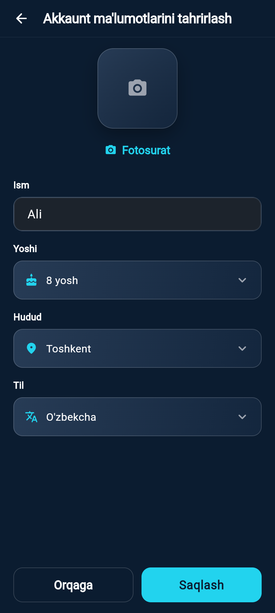

- **Fayl:** `account/presentation/screens/account_edit_screen.dart`
- **Maqsad:** Bola profilini tahrirlash — rasm, ism, yosh, viloyat, til.
- **Qachon/qayerdan ochiladi:** Settings "Profilni tahrirlash"; Profile avatar tap.
- **UI tuzilishi:** `ParvozHeader` → 120×120 avatar (tap → `_pickPhoto`, tanlangan bytes → backend URL → placeholder) + "Rasm o'zgartirish" → ism `TextField` → yosh picker (`AgeListDialog` 5-18) → viloyat picker (`RegionPickerBottomSheet`) → til picker (`_LanguagePickerSheet` uz/ru/en) → pastki "Orqaga"/"Saqlash".
- **Ma'lumot manbai:** `childDataStreamProvider` (bir martali yuklash, `_hasLoaded` flag), `childRepositoryProvider.uploadMyAvatar/updateMyProfile`.
- **Saqlash:** validatsiya (ism/yosh/viloyat) → avatar upload → profil update → stream+avatar invalidate → yashil SnackBar + pop.
- **Eslatma:** avatar URL cache-bust `?t=ms`; til → `context.setLocale`.

### Sozlamalar (`/settings`)

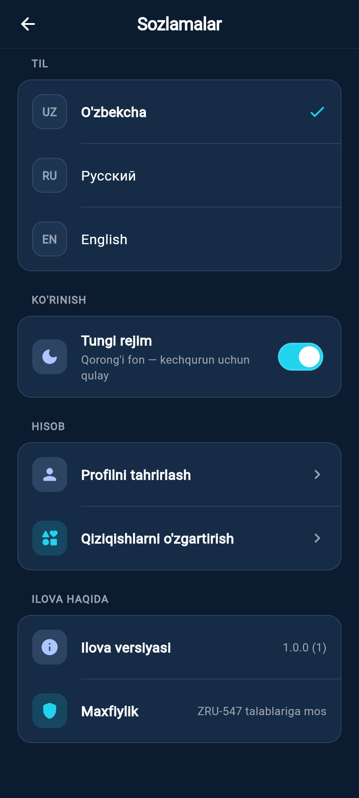

- **Fayl:** `settings/presentation/screens/settings_screen.dart`
- **UI tuzilishi:** `_Header` (orqaga + "Sozlamalar") → `ListView`: **TIL** (3 `_LangRow` UZ/RU/EN, tanlanganda yashil check, → `setLocale`) → **KO'RINISH** (`_ToggleRow` "Tungi rejim" Switch → `themeModeProvider.toggle()`) → **HISOB** ("Profilni tahrirlash" → `/account-edit`; "Qiziqishlar" → `InterestsEditSheet`) → **ILOVA HAQIDA** (versiya `PackageInfo`, "Maxfiylik" `ZRU-547`).
- **Eslatma:** orqaga — `canPop` bo'lsa pop, aks holda `/dashboard`.

### Profil — XP, daraja, yutuqlar (`/profile`)

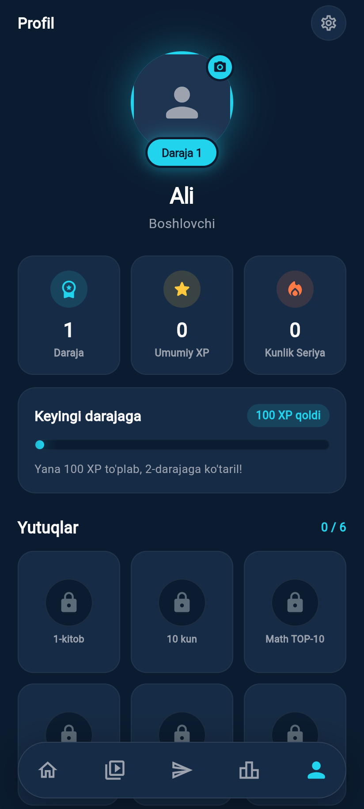

- **Fayl:** `gamification/presentation/screens/profile_screen.dart`
- **UI tuzilishi:** `_TopBar` (sozlamalar → `/settings`) → `_Hero` (116×116 avatar + 3.5px aqua ring + glow; edit badge → `/account-edit`; "Daraja N" badge; ism + status) → `_StatsRow` (Daraja / Umumiy XP / Kunlik Seriya) → `_ProgressCard` (keyingi darajaga progress, `xp%100`) → `_Achievements` (`GridView` 3 ustun, ochilgan rangli / qulflangan `lock`) → bottom nav + `ConfettiWidget`.
- **Ma'lumot manbai:** `gamificationProfileProvider`, `childAvatarUrlProvider`, `Achievements.all`.
- **Eslatma:** yangi yutuq aniqlanganda (`ref.listen` + `_previousAchievementIds`) → confetti + `heavyImpact` + SnackBar; `_initialLoaded` flag birinchi yuklashda confetti bermaydi.

### Bildirishnomalar (`/notifications`)

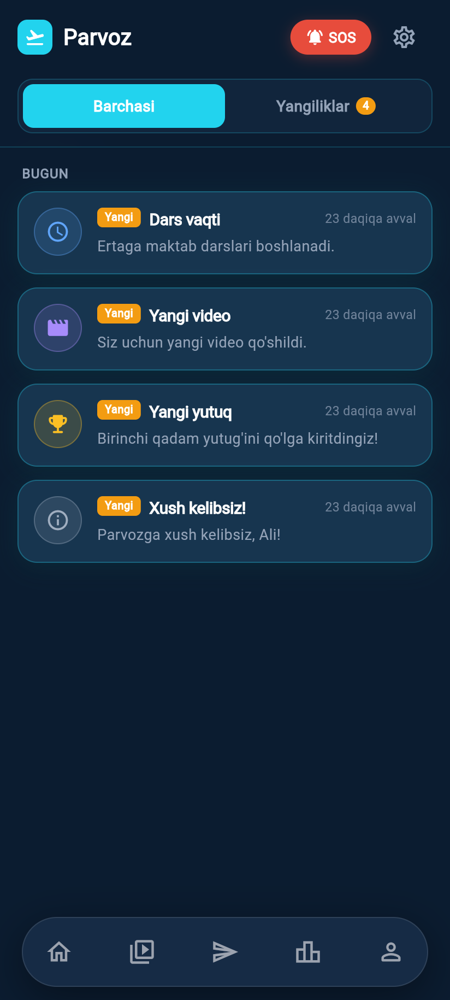

- **Fayl:** `notifications/presentation/screens/notifications_screen.dart`
- **Maqsad:** Barcha tizim bildirishnomalari — sana guruhlash, o'qilgan/o'qilmagan farq, swipe-o'chirish.
- **UI tuzilishi:** **Glass Header** (`BackdropFilter blur 18`): `_TopBar` (logo + "Parvoz" + qizil "SOS" pill → `/dashboard` + sozlamalar) + `_FilterTabs` ("Hammasi"/"O'qilmagan(N)"); **`_Body`**: sana bucket'lar (Bugun/Kecha/Avvalroq) + `_NotificationCard` (`Dismissible` swipe-delete; o'qilmagan — yashil mix + glow + "Yangi" chip + 44×44 medallion `type.color`; tap → markAsRead + `relatedRoute`); bo'sh → Faro `faceSleeping`; loading → 6 shimmer skeleton.
- **Ma'lumot manbai:** `notificationsProvider`, `filteredNotificationsProvider`, `notificationTabProvider`, `unreadNotificationsCountProvider`, `backendNotificationRepositoryProvider` (markAsRead/delete).
- **Turlari:** achievement/contest/schedule/parentRequest/voice/geoZone/system/studyNudge/healthNudge/contentReminder.
- **Eslatma:** staggered kirish (`fadeIn+slideY`, 40ms oraliq); real-time yo'q — manual invalidation; pull-to-refresh.

---

## 4. MEDIA KONTENT ekranlar

### Content Hub (`/content`)

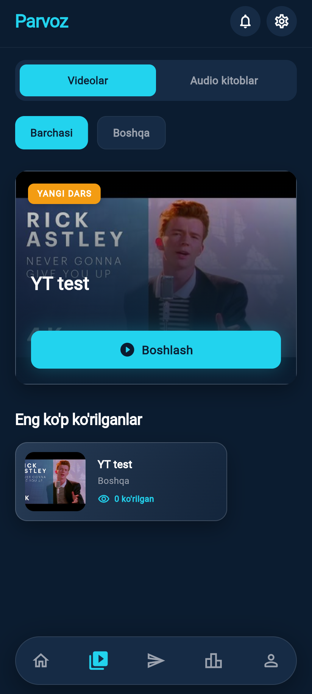

- **Fayl:** `content/presentation/screens/content_hub_screen.dart`
- **Maqsad:** Yagona "Kutubxona" — videolar + audiokitoblar + kitoblar bitta ekranda.
- **UI tuzilishi:** Parvoz Header (bell + settings) → **segment kontrol** ("Videolar"/"Audio kitoblar", tanlangan `pvGreen`, `AnimatedContainer` 250ms) → `TabBarView`:
  - **Videolar tab:** `_ParvozChips` (kategoriya, "Barchasi") → `_ParvozHeroCard` (280px, "YANGI DARS" badge + "Boshlash") → "Siz uchun tavsiyalar" (`_ParvozVideoHList`, "Barchasi" → `/videos`) → "Eng ko'p ko'rilganlar" (`_ParvozWideCard` + ko'rishlar). Bosish → `/video-player`.
  - **Audiokitoblar tab:** `_ParvozAudioChips` → `_ParvozAudioHero` ("Eshitish" + bookmark) → "Siz uchun" → "Eng ko'p eshitilganlar" (`_ParvozAudioRow`) → **Kitoblar seksiyalari** (`backendBooksProvider`, kategoriya: school/adabiyot/boshqalar → `/books/pdf`).
- **Ma'lumot manbai:** `effectiveVideosProvider`/`_parvozCategoryProvider`, `effectiveAudiobooksProvider`/`forYouAudiobooksProvider`/`mostListenedProvider`/`audiobookCategoryFilterProvider`, `backendBooksProvider`. `CachedNetworkImage` (offline kesh).
- **Eslatma:** Kitoblar audio-tab ichida (alohida route emas); `extendBody`; bo'sh → `_ParvozEmpty`.

### Videolar Feed (`/videos`)

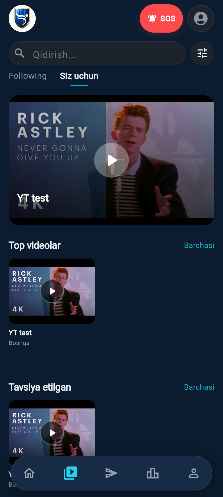

- **Fayl:** `videos/presentation/screens/videos_feed_screen.dart`
- **UI tuzilishi:** `DashboardTopHeader` (avatar → `/account-edit`) → `VideosSearchBar` → `VideoTabs` → `RefreshIndicator` → `HeroVideoCard` + `VideoSection` "Top videolar"/"Tavsiya etilgan" → bottom nav.
- **Ma'lumot manbai:** `heroVideoProvider`/`topVideosProvider`/`recommendedVideosProvider`/`filteredVideosProvider`, `backendVideosProvider` (pull-to-refresh invalidate, 5 daq kesh chetlab), `videoSearchQueryProvider`, `videoFilterProvider`.
- **Holatlar:** bo'sh → `EmptyStateMascot(faceSad)` + "Filterni tozalash".

### Video Player (`/video-player`) — 3 variant
Router `VideoModel` turiga qarab tanlaydi: `isYouTube` → YouTube; `isReels` → Reels; aks holda → Classic.

**A. YoutubePlayerScreen** (`videos/.../youtube_player_screen.dart`): YouTube embed `${apiUrl}/content/yt/$id` proxy sahifa orqali (xato 153 oldini olish — Chrome UA). Portret: 16:9 `WebViewWidget` + fullscreen tugma + "To'liq ekranda ko'rish" + tashqi YouTube (`open_in_new`). Landscape: immersiv. `markViewed` initState'da.

**B. ReelsPlayerScreen** (`videos/.../reels_player_screen.dart`): vertikal `PageView` (TikTok-uslub), har reel `VideoPlayer` (loop, tap → play/pause toggle, swipe → keyingi). `effectiveVideosProvider` (`!isYouTube && isReels`). `_viewed` Set bilan dedupe `markViewed`.

**C. ClassicVideoPlayerScreen** (`videos/.../classic_video_player_screen.dart`): landscape MP4 player. Controls overlay (gradient skrim, markaziy play/pause/replay, top bar, progress slider `pvGreen`, lock). Double-tap → `contain↔cover`; tezlik/uyqu taymeri/ekran qulfi (`PlayerSettingsBottomSheet`, `playerSettingsProvider`). 20s timeout → retry UI. `reportDuration` agar davomiylik noma'lum. `dispose`'da portret + edgeToEdge.

### Audiokitoblar Feed (`/audiobooks`)

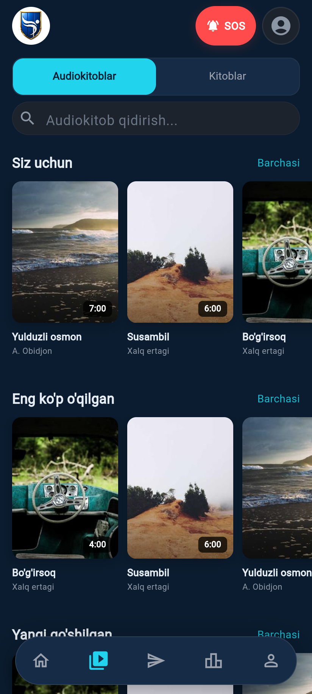

- **Fayl:** `audiobooks/presentation/screens/audiobooks_feed_screen.dart`
- **UI tuzilishi:** `DashboardTopHeader` → `_TopTabs` ("Audiokitoblar"/"Kitoblar") → `TabBarView`: Tab0 `AudiobooksSearchBar` + `AudiobookSection` ×3 ("Siz uchun"/"Eng ko'p o'qilgan"/"Yangi qo'shilgan"); Tab1 `BooksFeedBody`.
- **Ma'lumot manbai:** `forYouAudiobooksProvider`/`mostListenedProvider`/`newestAudiobooksProvider`/`filteredAudiobooksProvider`. Karta bosish → `audioPlayerProvider.play`.
- **Eslatma:** Books bottom nav'dan olib tashlandi (Sprint 5.x), bu yerga tab bo'lib ko'chdi.

### Audio Player (`/audio-player`)

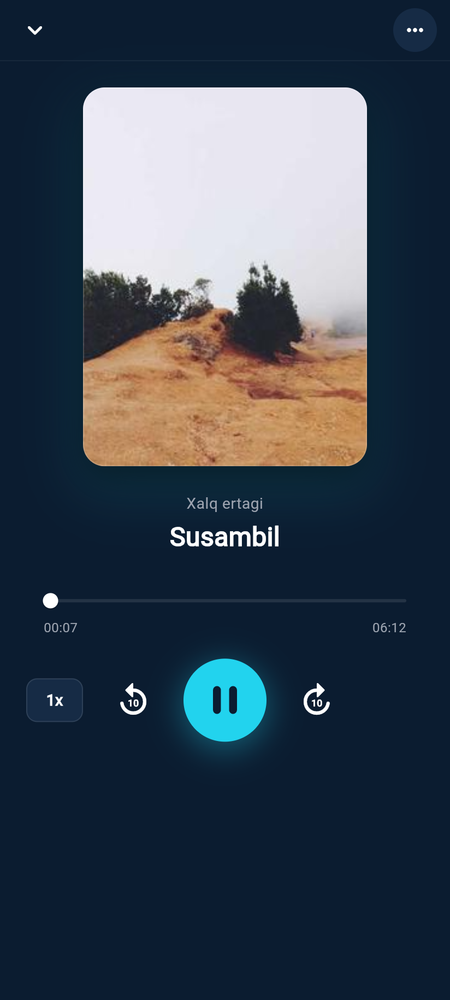

- **Fayl:** `audiobooks/presentation/screens/audio_player_screen.dart`
- **UI tuzilishi:** `_PlayerTopBar` (yopish + uyqu taymeri chip + menu) → `_Cover` (3:4, glass + yashil glow) → muallif + sarlavha → `_SliderRow` → `_Controls` (tezlik chip / -10s / katta play-pause 76px / +10s).
- **Bottom sheetlar:** `_SpeedPickerSheet` (0.5–2.0×) · `_AudioMenuSheet` · `_SleepTimerSheet` (5–45 daq) · `_DetailsSheet` (tafsilot + hashtag).
- **Ma'lumot manbai:** `audioPlayerProvider` (currentBook/isPlaying/position/duration/sleepTimer), `audioSpeedProvider`. `!hasAudio` → avto-pop.

### Kitoblar Feed (`/books`)

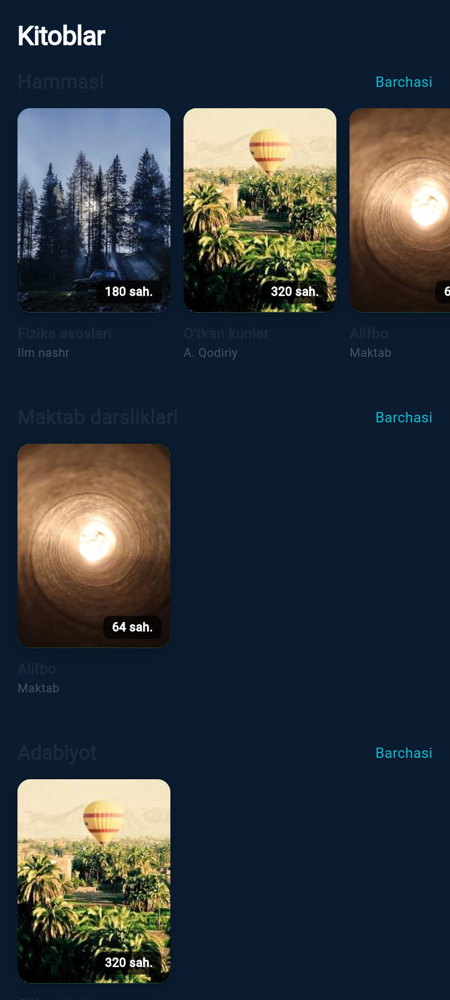

- **Fayl:** `books/presentation/screens/books_feed_screen.dart`
- **UI tuzilishi:** `asyncBooks.when`: loading spinner / xato `_ErrorView` (retry) / data `RefreshIndicator` + `BookSection` ("Hammasi"/"Maktab darsliklari"/"Adabiyot"/"Boshqalar") / bo'sh `_EmptyView`.
- **Ma'lumot manbai:** `backendBooksProvider`. Karta → `/books/pdf`.
- **Eslatma:** ko'proq `AudiobooksFeedScreen` ichida `BooksFeedBody` sifatida ishlatiladi.

### PDF Viewer (`/books/pdf`)

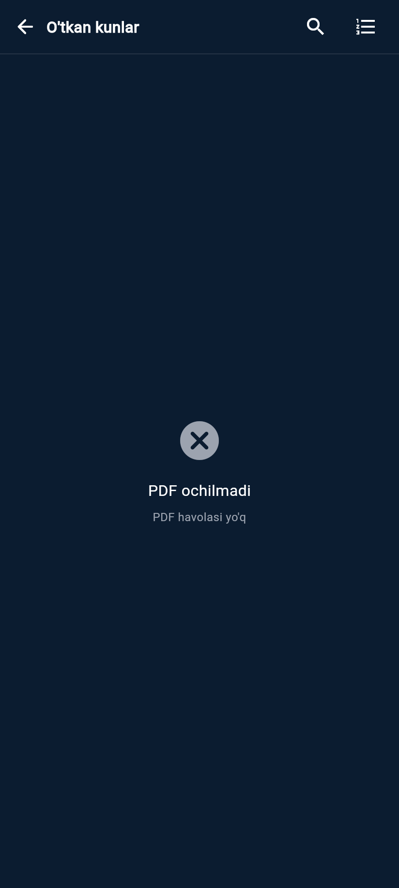

- **Fayl:** `books/presentation/screens/pdf_viewer_screen.dart`
- **UI tuzilishi:** top bar (orqaga + sarlavha + qidirish placeholder + "Sahifaga o'tish" dialog + N/Jami) → kontent (yuklanmoqda: cover + spinner; xato; tayyor: `PDFView`) → `_PageScrubber` (slider + first/last page).
- **Ma'lumot manbai:** `book.pdfUrl` → `Dio.download` → tmp `book-{id}.pdf` (kesh: `File.exists`); `markRead` initState fire-and-forget. `flutter_pdfview` (vertikal, `FitPolicy.WIDTH`).
- **Eslatma:** qidiruv hali placeholder; tap → bottom bar toggle.

---

## 5. MAQOLA / KONKURS / REYTING ekranlar

### Maqolalar Feed (`/articles`)

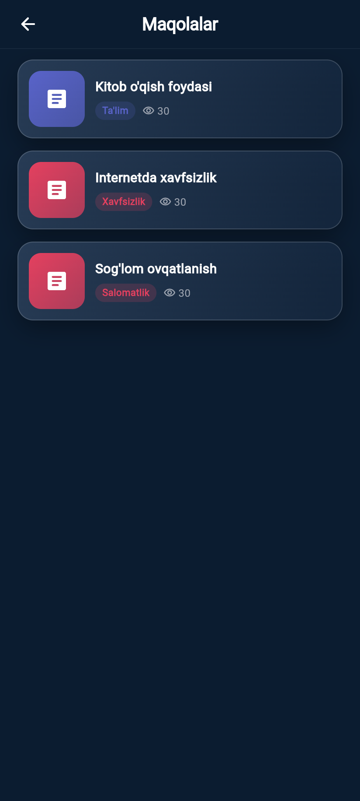

- **Fayl:** `articles/presentation/screens/articles_feed_screen.dart`
- **UI tuzilishi:** `ParvozHeader` ("Maqolalar" + orqaga) → `backendArticlesProvider.when`: loading spinner / error `_Empty`(`wifi_off` + "Qayta urinish") / bo'sh `_Empty`(`menu_book`) / data `RefreshIndicator` + `ListView.separated` → `ArticleCard` (tap → `/articles/view`, `extra: ArticleModel`).
- **Eslatma:** `AlwaysScrollableScrollPhysics` (pull-to-refresh bitta elementda ham); bo'sh va xato uchun har xil ikon/matn.

### Maqola ko'rish (`/articles/view`)

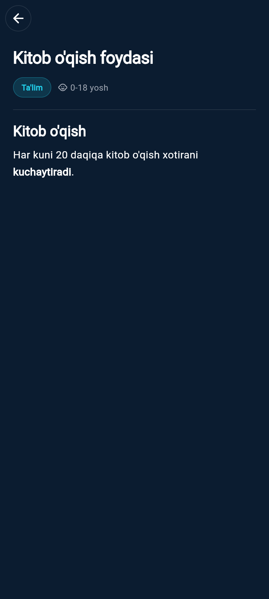

- **Fayl:** `articles/presentation/screens/article_view_screen.dart`
- **UI tuzilishi:** `CustomScrollView`: `SliverAppBar` (cover bo'lsa 240px `FlexibleSpaceBar` + gradient overlay; doiraviy orqaga tugma) → kontent: sarlavha (26px bold) + kategoriya yashil pill + "yosh guruhi" + divider + `MarkdownBody` (`selectable`, maxsus `_markdownStyle` — p/h1/h2/h3/blockquote/link).
- **Ma'lumot manbai:** `ArticleModel` (`extra`), `markRead(article.id)` initState fire-and-forget.
- **Eslatma:** cover yo'q bo'lsa `expandedHeight:0`; `flutter_markdown`.

### Konkurslar (`/contests`)

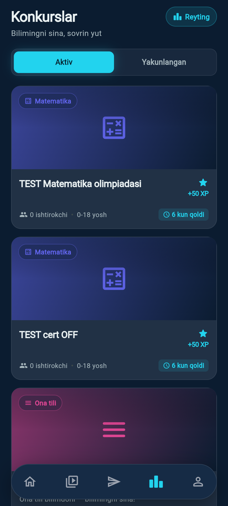

- **Fayl:** `contests/presentation/screens/contests_screen.dart`
- **UI tuzilishi:** Header ("Konkurslar" + "Bilimingni sina, sovrin yut" + "Reyting" pill → `/ranking`) → `ContestsTabs` (aktiv/yakunlangan) → `_List`: loading spinner / xato `_ErrorState`(retry) / bo'sh (84×84 ikon doirasi) / `ListView` `ContestCard`.
- **Ma'lumot manbai:** `contestsActiveTabProvider`, `activeContestsProvider`/`finishedContestsProvider`, `contestsLoading/ErrorProvider`, `backendContestsProvider`. Palitra `CP(context.adaptive.isDark)`.

### Konkurs boshlash (`/contest-start`)

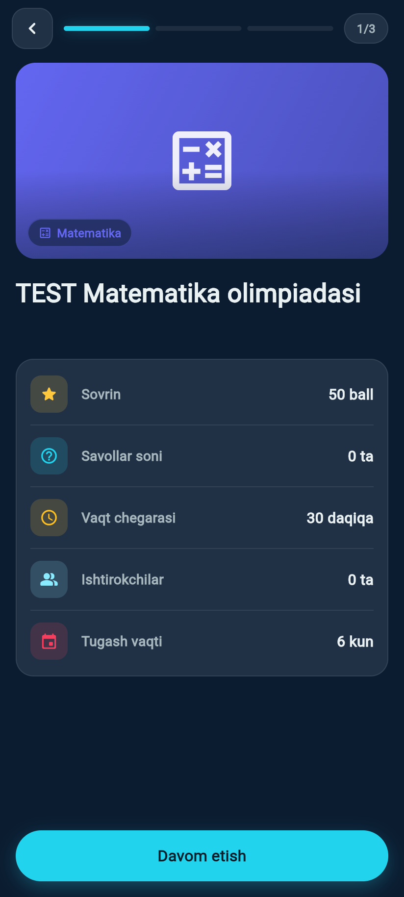

- **Fayl:** `contests/presentation/screens/contest_start_screen.dart`
- **Maqsad:** 3 bosqichli tayyorlik: ma'lumot → qoidalar → tayyor/countdown.
- **UI tuzilishi:** `_TopBar` (orqaga + 3 progress segment + "N/3" pill) → `PageView` (swipe o'chiq):
  - **Step 0** `_ContestInfoStep`: 200px rasm + `SubjectBadge` → sarlavha + tavsif → `_StatGroup` (Sovrin/Savollar/Vaqt/Ishtirokchilar/Tugash) → "Davom etish".
  - **Step 1** `_ContestRulesStep`: "Konkurs qoidalari" + 5 `_RuleCard` (Vaqt/Qaytarish yo'q/Internet/Halol/Bonus) → "Davom etish".
  - **Step 2** `_ContestReadyStep`: pulsing trophy (180/124px, `_pulseController`) + "Tayyormisiz?" + "BOSHLASH" → `_startCountdown` → `_Countdown` (3..2..1, `elasticOut`) → `pushReplacement('/contest-quiz')`.
- **Ma'lumot manbai:** `ContestModel` (`extra`). `pushReplacement` — quiz tugagach `/contests`ga qaytadi.

### Konkurs savol-javob (`/contest-quiz`)

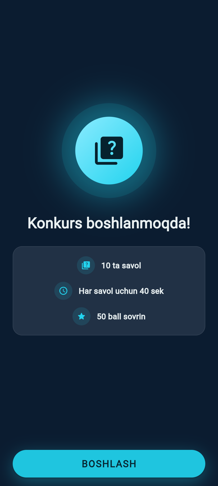
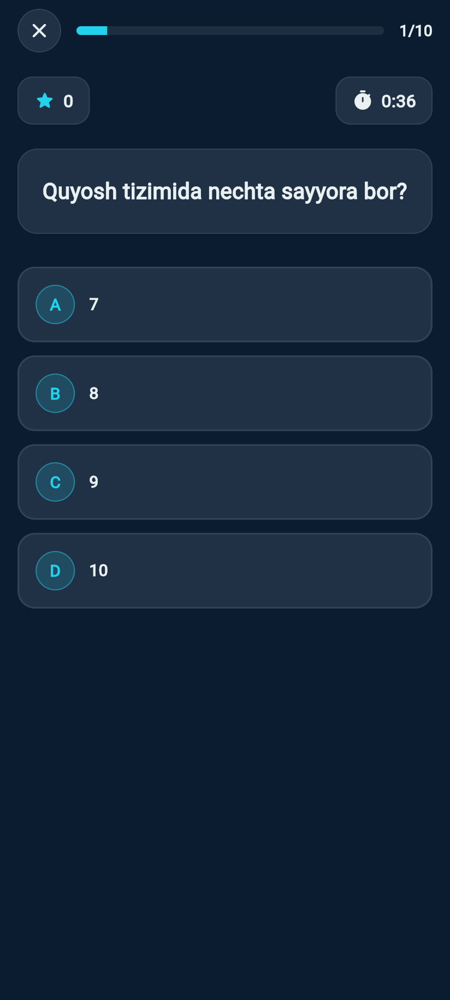

- **Fayl:** `contests/presentation/screens/contest_quiz_screen.dart`
- **UI tuzilishi:** `quizProvider(contest).status` bo'yicha: `loading` → `_LoadingScreen`; `intro` → `_IntroScreen` (pulsing quiz + 3 stat + "BOSHLASH"); `playing/paused` → `_QuestionScreen`; `finished` → `_ResultScreen`. Ustida `ConfettiWidget`.
  - **`_QuestionScreen`:** `_QuestionTopBar` (close → pause dialog + `LinearProgressIndicator` + "N/10") → `_StreakBadge` (`streak>=3`) → `_ScoreTimerRow` (score + taymer, `<=10s` qizil) → savol kartasi + variantlar `_OptionCard` (to'g'ri `catMint` + check / xato `danger` + cancel, harf badge A/B/C) + tushuntirish bloki. Pause dialog ("Chiqish" → `quit`+`/contests` / "Davom etish" → `resume`).
  - **`_ResultScreen`:** g'olib trophy / mag'lub `psychology` → "Tabriklaymiz!"/"Yaxshi urinish!" → 5 `_ResultStat` (To'g'ri/Ball/Aniqlik/Streak/Vaqt) → g'olib bo'lsa "Sertifikat" (`p.gold`) → "Ulashish" (`share_plus`) + "Yopish" (`/contests`).
- **Ma'lumot manbai:** `quizProvider(contest)` (QuizState), `certificateRepositoryProvider.fetch(attemptId)`.
- **Eslatma:** confetti — streak 3/6/9... + g'alaba; taymer `<=10s` qizil; haptic to'g'ri/xato/timeout; pauzada progress saqlanmaydi.

### Sertifikat (`/certificate`)

- **Fayl:** `contests/presentation/screens/certificate_screen.dart`
- **Maqsad:** G'olib sertifikatini ko'rsatish + PNG saqlash/ulashish (`RepaintBoundary` `pixelRatio:3`).
- **UI tuzilishi:** `ParvozHeader` → `RepaintBoundary > _Certificate` (340px, gold gradient ramka, deep navy ichki, radial dekoratsiyalar, "PARVOZ" brend, kubok medallion, "SERTIFIKAT", `childNick`, olimpiada nomi, natija paneli Natija/Ball/Fan, sana + `certificateId`) → `_ShareButton` ("Saqlash / Ulashish").
- **Ma'lumot manbai:** `CertificateData` (`extra`). Share → `toImage(3x)` → tmp PNG → `Share.shareXFiles`.
- **Eslatma:** `_sharing` flag; palitra qat'iy (theme'siz, doim premium); `childNick` (to'liq ism emas — maxfiylik); O'zbek oy nomlari.

### Reyting (`/ranking`) — yangi Stitch redizayn

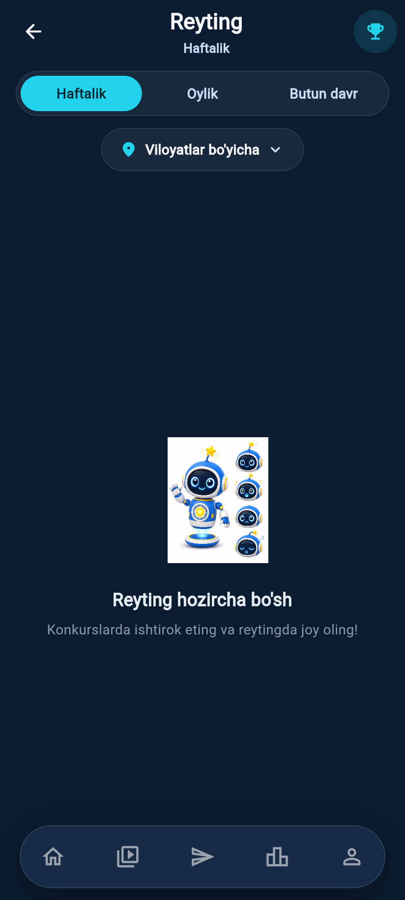

- **Fayl:** `ranking/presentation/screens/ranking_screen.dart`
- **UI tuzilishi:** `_Header` (orqaga + "Reyting" + range subtitle + trophy) → `_RangePills` ("Haftalik"/"Oylik"/"Butun davr", aqua sliding indicator `Cubic(.34,1.4,.5,1)` 320ms) → `_RegionFilter` ("Viloyatlar bo'yicha" pill → `_RegionSheet`) → `_List`:
  - `_Podium` (2-1-3, medal rangli halqa + glow + raqam badge, 1-o'rin 88px + trophy);
  - `_RankTile` (4+, raqam + 44px avatar + ism + "SIZ" pill + viloyat + `_ScorePill` gold star), stagger `fadeIn+moveY` 45ms;
  - `_StickyCurrentUser` (`currentRank>3` bo'lsa pastda aqua pin).
- **Ma'lumot manbai:** `filteredUsersProvider`, `timeRangeProvider`, `selectedRegionProvider`, `currentUserRankProvider`, `rankingTabProvider`, `backendRankingProvider`, `scoreFor(user,range)`. `_RegionSheet` — `UzbekistanRegions.all`.
- **Holatlar:** `users.length<3` → Faro `faceExcited` bo'sh holat; pull-to-refresh; sticky padding `180/120`.
- **Eslatma:** adaptiv palitra; haptic (range/region selectionClick, refresh mediumImpact); Plus Jakarta Sans.

---

## 6. ALOQA / JADVAL / CHEKLOV / SOS ekranlar

### Video xabar yozish (`/video-recording`)

- **Fayl:** `video_message/presentation/screens/video_recording_screen.dart`
- **Maqsad:** Selfie kamera orqali ≤15s video xabar yozib ota-onaga yuborish.
- **Qachon/qayerdan ochiladi:** Ota-ona "Video so'rash" → push/banner → `/video-recording?requestId=<ID>`; yoki bola o'zi (requestId null).
- **UI tuzilishi:** yopish tugma → loading spinner / xato matni / tayyor: `RecordingProgressRing` (280px, 0→1) + `CircularCameraPreview` (dumaloq selfie) + timer "X/15 sek" + `RecordButton` (long-press → yoz, qo'yib yubor → to'xta).
- **Ma'lumot manbai:** `VideoRecorderService` (init/start/stop, `maxDurationSeconds=15`). Yozilgach `VideoPreviewArgs` bilan `pushReplacement('/video-preview')`.
- **Eslatma:** `Permission.camera`+`microphone` ikkisi ham; min 1500ms (qisqa → o'chiriladi + snackbar); 15s avto-stop; background/dispose → fayl o'chadi.

### Video xabar ko'rish (`/video-preview`)

- **Fayl:** `video_message/presentation/screens/video_preview_screen.dart`
- **UI tuzilishi:** yopish → 280px dumaloq `VideoPlayer` (loop, ovozsiz) + upload paytida progress halqa → status matni ("X soniya"/"Yuklanmoqda X%"/"Yuborildi") → tugmalar ("Bekor" → fayl o'chir + pop; "Yuborish" → upload).
- **Ma'lumot manbai:** `videoMessageUploadProvider` (idle/uploading/sent/error); `BackendVideoMessageRepository.sendMessage(receiverId:parentUid, videoFile, durationSeconds, onProgress)` → `POST /api/video-messages`. Tugagach `videoMessagesProvider` invalidate.
- **Eslatma:** upload paytida yopish disabled; sent → 1200ms snackbar + pop; web — `sendBytes()`.

### Ovozli/matnli chat (`/voice-chat`)

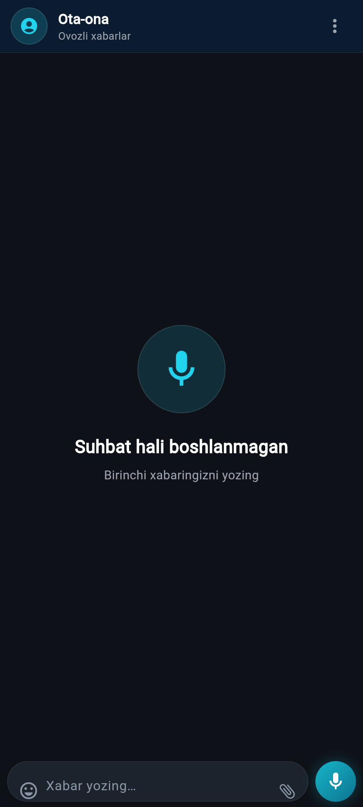

- **Fayl:** `voice_message/presentation/screens/voice_chat_screen.dart`
- **Maqsad:** Bola↔ota-ona real-time chat: ovoz, yumaloq video, matn, media.
- **UI tuzilishi:** `_ChatHeader` (avatar + ota-ona nomi + holat + `more_vert` → `ChatSettingsScreen`) → `ChatBackground` → `ListView` (`VoiceItem`→`ChatBubble`, `VideoItem`→`RoundVideoBubble`, avto-scroll) → bo'sh `_EmptyState`(mic) → `ChatInputBar` (videocam + mic long-press + matn + attach; yozish paytida to'lqin vizualizatsiya + taymer + delete).
- **Ma'lumot manbai:** `chatMessagesProvider` (voice+video merge ASC); `voiceMessagesProvider`/`videoMessagesProvider` (WS `voice:received`/`video:received` refresh); `sendText`/`sendMedia`; `AudioRecorderService` (amplitude stream); `AudioPlayerManager`.
- **Amallar:** mic long-press → ruxsat → yoz → release → min 1500ms → upload; videocam → `showRoundVideoRecorder` → `VideoCompress` → upload; ekran ochilganda `markAllRead()` bulk.
- **Eslatma:** web — `readAsBytes` `.webm`, compress yo'q; mobile `LowQuality` (413 himoya); background → yozish avto-bekor; `ChatTopToast`.

### Jadval (`/schedules`)

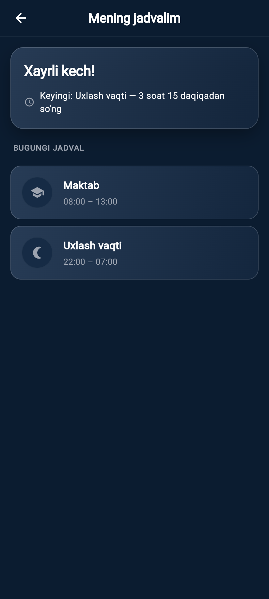

- **Fayl:** `schedules/presentation/screens/schedules_screen.dart`
- **Maqsad:** Bugungi uxlash/dars jadvali — faqat ko'rish (read-only). Hozir aktiv + keyingisi qachon.
- **UI tuzilishi:** `ParvozHeader` → loading skeleton / xato / bo'sh `EmptyStateMascot(faceSleeping)` / data: `_StatusCard` (salomlashuv vaqtga qarab + "Hozir:"/"Keyingi: N daqiqa") + `ParvozSectionLabel` "Bugungi jadval" + `ScheduleTile` ro'yxati (`isCurrent`).
- **Ma'lumot manbai:** `activeSchedulesProvider` (`GET /children/:id/routines`), `todayRoutinesProvider` (`/routines/today` → today/current/next).
- **Eslatma:** `Timer.periodic(1 daq)` → status yangilanadi; salomlashuv soatga qarab; read-only.

### Ilovalar statistikasi (`/analytics`)

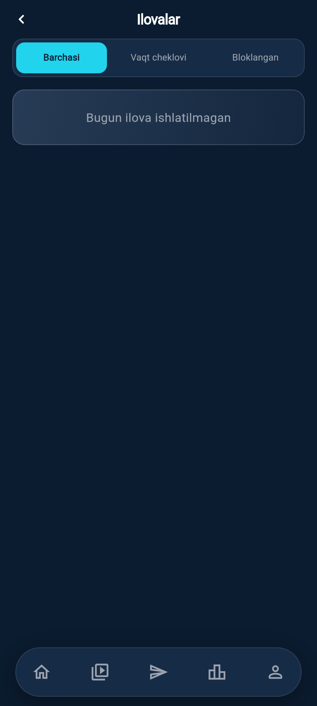

- **Fayl:** `analytics/presentation/screens/analytics_screen.dart`
- **UI tuzilishi:** `AppBar` (orqaga + "Ilovalar" + 3-tab "Barchasi"/"Vaqt cheklovi"/"Bloklangan") → `TabBarView`:
  - **Tab0** `_AllAppsTab`: `AppUsageList()`.
  - **Tab1** `_LimitedAppsTab`: `childAppLimitsProvider` → `_LimitTile` (ikon + "X/Y daqiqa" + progress bar + "Qoldi/Tugadi"). Bo'sh → `_Empty(hourglass)`.
  - **Tab2** `_BlockedAppsTab`: to'liq blok (`dailyLimitMs==0`) → `_BlockTile` (qizil "Bloklangan" badge). Bo'sh → `_Empty(block)`.
- **Ma'lumot manbai:** `childAppLimitsProvider` (`GET /children/:id/app-limits?isActive=true`), `installedAppsMapProvider`, `dailyUsageProvider` (**avval native `UsageStatsService.getUsageStats(days:1)`** MethodChannel `farzandim/usage_stats`, ruxsat yo'q → backend `/analytics/usage`).
- **Eslatma:** bugungi statistika qurilmadan (tezkor, offline); ikon 3 usul (url→base64→fallback); `_formatMs`.

### Ilova bloklash overlay + UnlockRequestModal (native + widget)

- **Fayllar:** `app_restrictions/.../unlock_request_modal.dart`, `.../unlock_request_bridge.dart`, `.../unlock_request_provider.dart`, `.../restrictions_sync_service.dart`
- **Maqsad:** Native `RestrictionService` (Accessibility + Foreground Service) bloklangan ilova ochilganda `SYSTEM_ALERT_WINDOW` overlay ko'rsatadi. Bola "Ruxsat so'rash" bossa → Flutter modal → ota-onaga "qo'shimcha vaqt" so'rovi.
- **Qachon/qayerdan ochiladi:** Native overlay (Flutter ekrani EMAS). "Ruxsat so'rash" → Parvoz Intent (`unlock_request_package`). Cold start: `unlockPendingCheckProvider` → `checkPending()` → `consumePendingUnlock`; ochiq: `onUnlockRequested` MethodChannel.
- **`UnlockRequestModal` UI:** drag handle → `lock_clock_rounded` + "Qo'shimcha vaqt so'rash" → savol (appName bilan) → **daqiqa chiplari (5/15/30/60, default 15)** → "Sabab (ixtiyoriy)" `TextField` (200 belgi) → `PrimaryButton("SO'RASH")` (`mediumImpact` → `Navigator.pop(UnlockRequestInput)`).
- **Bloklash mexanizmi (`RestrictionsSyncService`, har 30s + WS):** SharedPreferences'ga yozadi — `restriction.blocked_packages` (limit 0 / schedule BLOCK oynasi `"*"` / `blockAllApps` `"*"` / routine `blockedApps`), `restriction.limits` (`pkg:minutes`), `restriction.block_unknown_sources`.
- **Ma'lumot manbai:** `BackendScheduleRepository`/`AppLimitRepository`/`RoutineRepository`/`DevicePolicyRepository`, `BackendUnlockRequestRepository.createRequest(kind, packageName, requestedMinutes, reason)`. MethodChannel `farzandim_child/unlock` + `farzandim/usage_stats`.
- **Eslatma:** `SYSTEM_ALERT_WINDOW` + `PACKAGE_USAGE_STATS` + Accessibility kerak; wrap-around oynalar (22:00–06:00); `"*"` wildcard barcha ilova; sync 30s safety net + WS darhol.

### SOS — alohida ekran yo'q (provider + widget)

- **Fayl:** `sos/presentation/providers/sos_provider.dart` (ekran yo'q — `SosButton` widget Dashboard'da)
- **Maqsad:** Xavf paytida ota-onaga zudlik signal.
- **Ma'lumot manbai:** `sosStateProvider` (idle/sending/sent/error), `BackendSosRepository.triggerAlert(childId, lat?, lng?, accuracy?)` → `POST /api/children/:id/sos-alerts`. Joylashuv: `getLastKnownPosition` (kesh) → `getCurrentPosition` (3s timeout) → bo'lmasa `null` (SOS to'xtamaydi).
- **Eslatma:** backend → ota-onaga FCM HIGH + WS + Google Maps havola; pairing yo'q → darhol error.

---

## 7. Kesishuvchi (cross-cutting) komponentlar

### 7.1 ChildBottomNavigation (suzuvchi pill)
5 ta tab: Bosh sahifa (`/dashboard`, `go`) · Kutubxona (`/content`) · Xabar (`/voice-chat`) · Konkurs (`/contests`) · Profil (`/profile`). Faol tab aqua + `AnimatedScale(1.12)`. `kEnableContentLibrary == false` bo'lsa nav ko'rinmaydi. Ustida audio o'ynayotganda `MiniAudioPlayer`.

### 7.2 Ruxsatlar (yangilangan — 4 ta eng zarur)
Birinchi ochilishda faqat: **Bildirishnoma** · **Ilova nazorati** (PACKAGE_USAGE_STATS) · **Ilova ustida ko'rsatish** (SYSTEM_ALERT_WINDOW) · **Quvvat optimizatsiyasi**. Geolokatsiya/mikrofon/OEM ruxsatlari ixtiyoriy — keyin Sozlamalardan beriladi. Dashboard `_guardPermissions` ham shu 3 ta nazorat ruxsatini tekshiradi (lokatsiyasiz ham dashboard ochiladi).

### 7.3 Asosiy backend endpointlar (bola)
- Auth: `POST /auth/child-pair`, `GET /child-pair-status/:id`, `POST /auth/repair-redeem`
- Profil: `PUT /children/me/profile`, `POST /children/:id/avatar`, `GET /children/:id/avatar/image`
- Statistika: `GET /analytics/usage`, `GET /children/:id/app-limits`, native `farzandim/usage_stats`
- Kontent: videolar/audiokitob/kitob/maqola/konkurs feed'lari + `markViewed`/`markRead`
- Aloqa: `GET/POST /voice-messages`, `GET/POST /video-messages`, `POST /children/:id/sos-alerts`
- Cheklov: `GET /children/:id/routines`, `app-limits`, `device-policy`, unlock-requests
- Bildirishnoma: `GET /notifications`, `markAsRead`, `deleteNotification`
- Reyting/XP: `GET /leaderboard`, gamification profil

### 7.4 Native (Android) integratsiya
- `RestrictionService` (Accessibility + Foreground Service) — ilova bloklash + o'yin aniqlash
- `BootReceiver` — reboot/update'dan keyin servisni tiklaydi; `flutter_foreground_task` `autoRunOnBoot`
- `UsageStatsService` (MethodChannel) — usage stats + overlay ruxsati
- `SYSTEM_ALERT_WINDOW` overlay — bloklash ekrani (Flutter UI emas, native)

---

*Hujjat avtomatik generatsiya qilindi — kod o'zgarganda yangilash kerak. Oxirgi yangilanish: 2026-06.*
